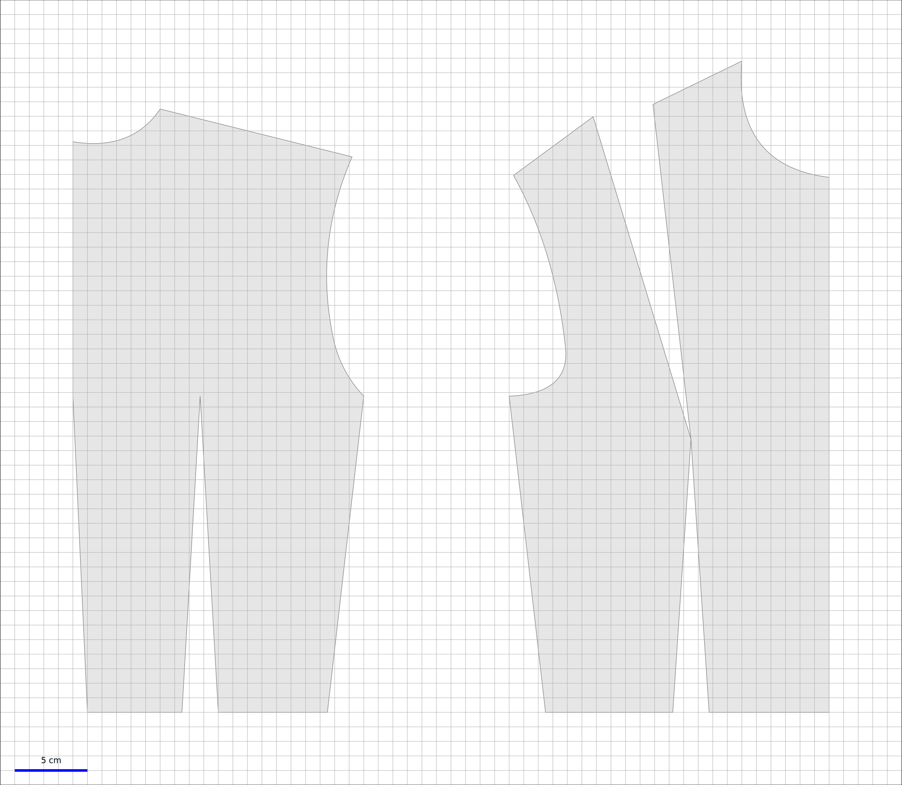

# OpenPattern

----
* [Introduction](##introduction)
* [Installation and Requirements](##Installation-and-Requirements)
* [Example](##Example)
* [Documentation](##Documentation)

-----------
## Introduction <a class="anchor" id="introduction"></a>
OpenPattern is a python library consisting of a set of classes designed to draft 1:1 scale bespoke sewing patterns and save them as pdf (or matplotlib compatible) files for printing of further processing.

Printing can be performed at fullscale on a tracer but OpenPattern can also cut the pattern in as many pieces as needed in order to print them on an A4 printer at home.

OpenPattern can be used to draft patterns from scratch but also includes a set of predefined patterns from bases such as bodices to more elaborate patterns such as shirts.
The patterns are drafted following instructions from three main stylists: <a href="https://lespressesdumidi.com/content/18-jacqueline-chiappetta">Jacqueline Chiappetta</a>, <a href="https://www.editions-eyrolles.com/Auteur/86662/teresa-gilewska">Theresa Gilewska</a> and <a href="https://www.euromodeschool.it/index.html">Antonnio Donnano </a>.  Sizes are stored in a sqlite3 database. By default they include a series of standard (French and Italian) sizes for Women, Men, Girls and Boys given by these authors.

## Installation and Requirements <a class="anchor" id="installation-and-requirements"></a>

### Requirements
OpenPattern requires the following libraries to work properly.
* matplotlib
* numpy
* scipy
* json
* sqlite3

If you want to access the measurements database from the terminal or some GUI you'll have to install the sqlite3 engine

### Installation

To install the library you must first
* clone the directory somewhere on your computer
* open a terminal in the root directory
* run ```python3 setup.py install```.
sudo rights may be needed depending on your computer configuration.

OpenPattern comes with an sqlite3 ```measurements.db``` database. This base contains a set of standard French and Italian sizes.

By default OpenPattern assumes that this file resides in the *same directory* as your scripts. This is the simplest way to start rapidly. Yet you can place it anywhere and tell OpenPattern where to search for it (see the doc for more informations).


## Example <a class="anchor" id="Example"></a>

The most simple way to use OpenPattern is to take advantage one of its predefined patterns. In the example script we plot the bodice  of a women size 36 (French) with bust and waist darts.

```python
import matplotlib.pyplot as plt
import OpenPattern as OP


# Create instance of base class
p = OP.Basic_Bodice(pname = "W36G", gender = 'w', style = 'Gilewska')

# Add darts
p.add_bust_dart()
p.add_waist_dart()

# Call the draw method
p.draw({"Pattern":"Bodice with darts"},save=True)

# Look at the result
plt.show()
```
The result looks like


## Documentation <a class="anchor" id="documentation"></a>
for more informations on the use of the library see the <a target="_blank" href="https://openpattern.readthedocs.io/en/latest/index.html">Documentation on read the docs</a>.

typical samples of scripts and patterns can be found in the sampleScripts and samplePatterns section in the docs.
