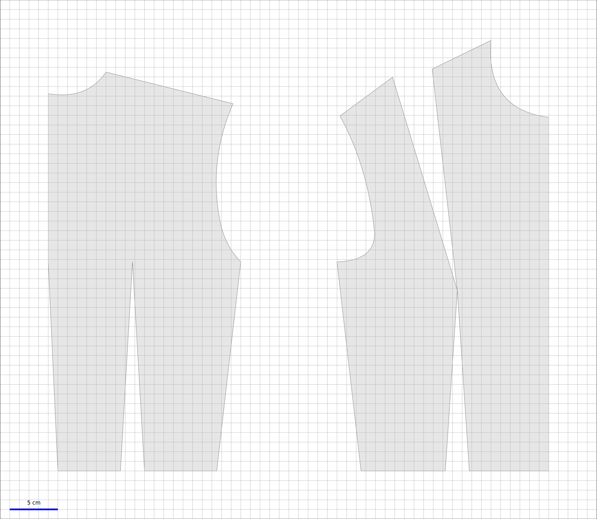

# OpenPattern

OpenPattern is a library that enables to draft 1:1 scale bespoke sewing patterns and save them as pdf files for printing. The patterns are drafted following instructions from three main stylists: Jacqueline Chiappetta, Theresa Gilewska and Antonnio Donnano.  Sizes are stored in a sqlite3 database. By default they include a series of standard (French and Italian) sizes for Women, Men, Girls and Boys.


## Exemple
```python
import matplotlib.pyplot as plt
import OpenPattern as OP

# Create instance of base class
p = OP.Basic_Bodice(pname = "W36G", gender = 'w', style = 'Gilewska')

# Add darts
p.add_bust_dart()
p.add_waist_dart()

# Call the draw method
p.draw({"Pattern":"Bodice with darts"},save=True)

# Look at the result
plt.show()
```
And the result looks like


## Documentation
for more informations on the use of the library see the (French) Documentation OpenPattern.pdf in the docs section.


## Requires
* matplotlib
* numpy
* scipy
* json
* sqlite3  
If you want to access the database from the terminal or some GUI you'll have to install the sqlite3 engine
