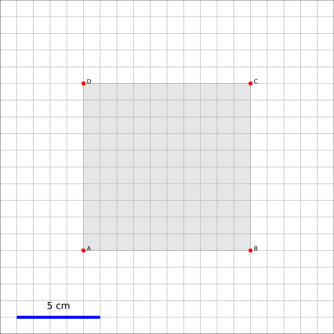
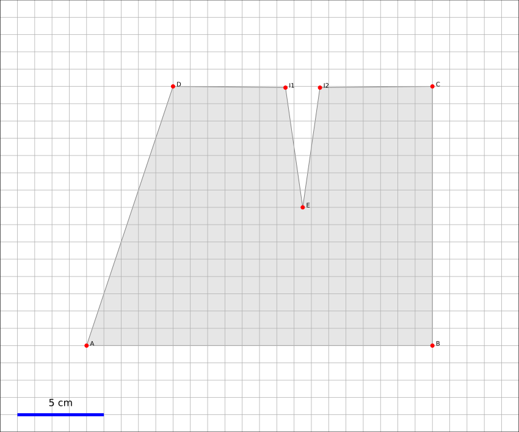
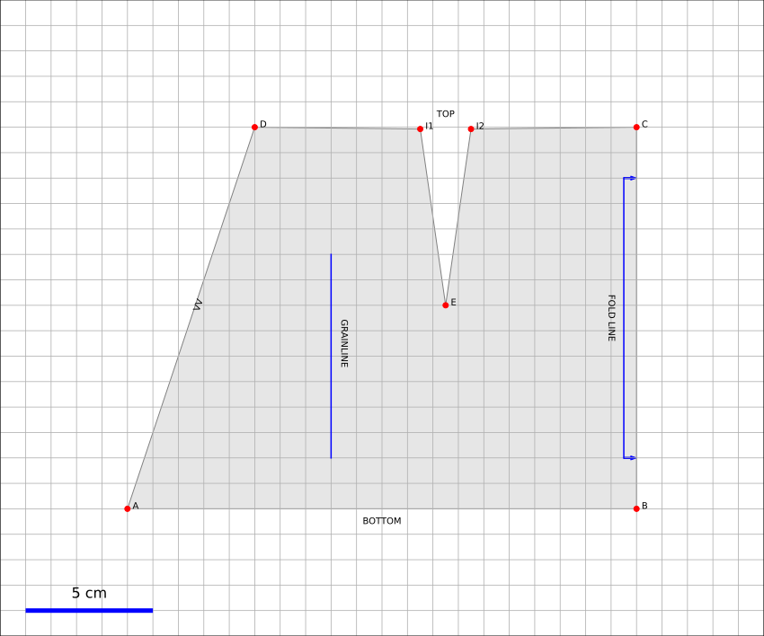
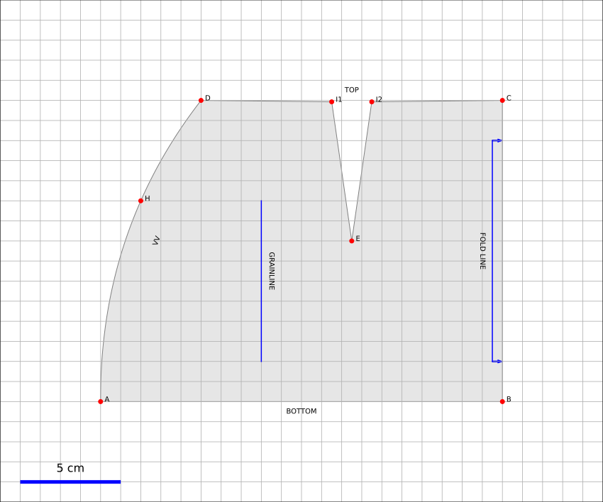
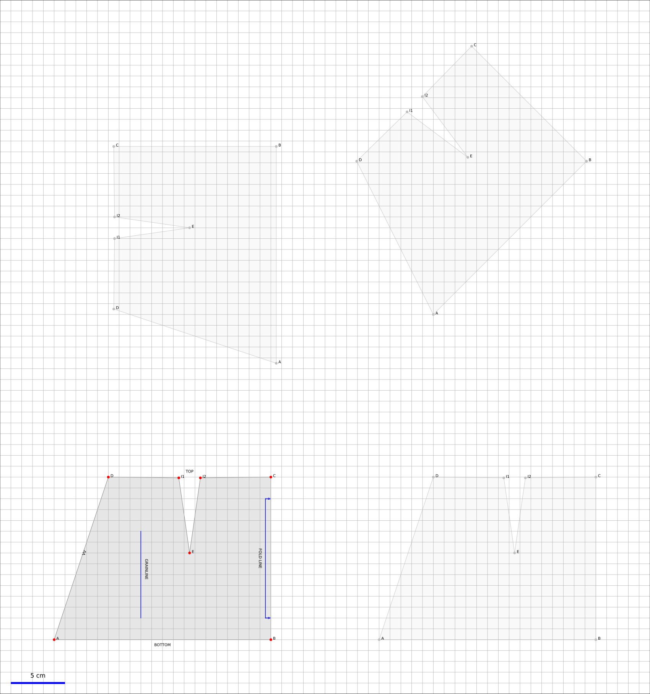
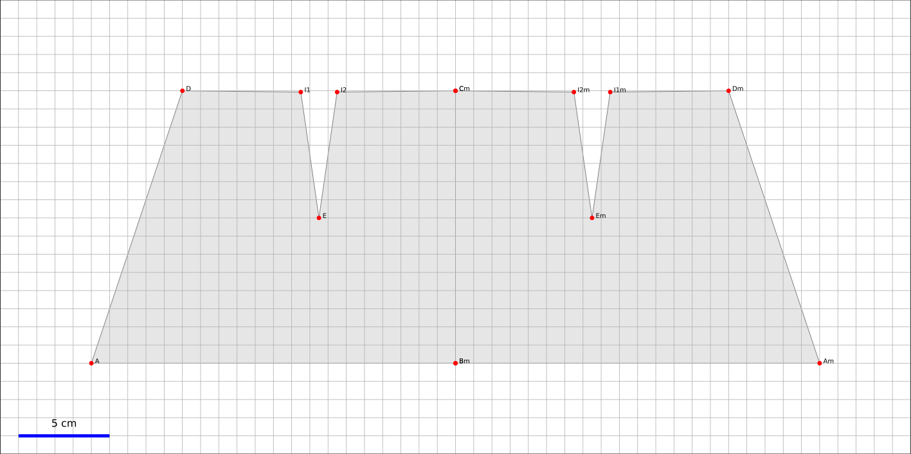
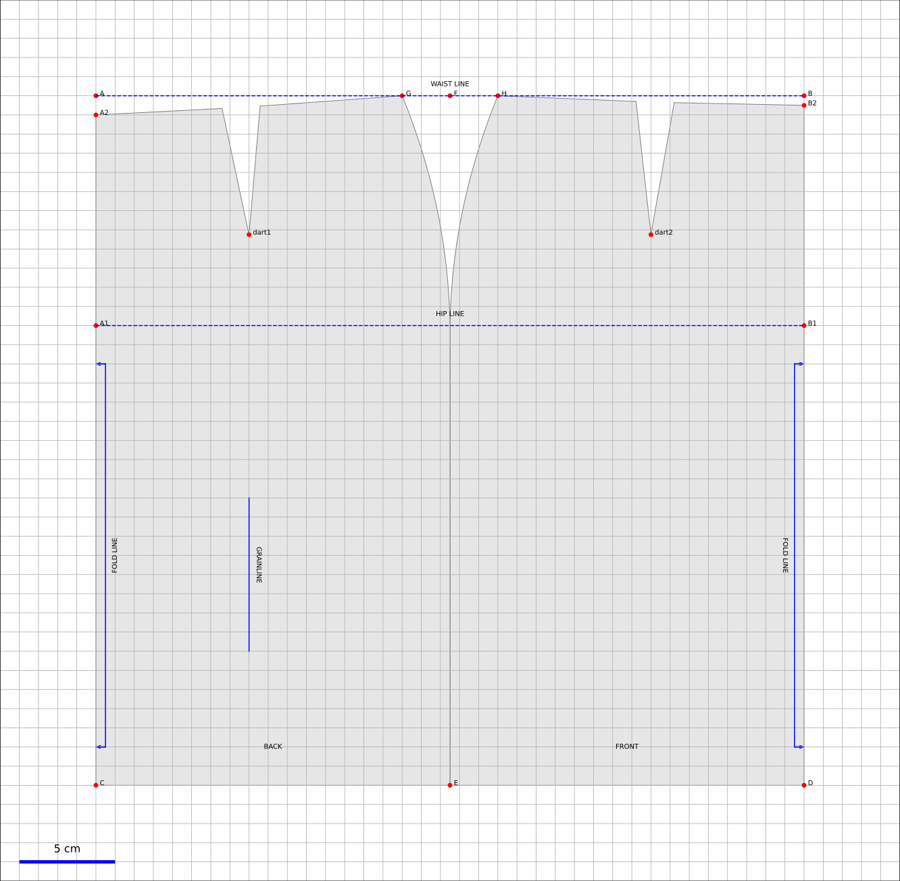

OpenPattern from scratch
------------------------

Draw me a square
~~~~~~~~~~~~~~~~

The following script shows how to draw a square (of fabrics :=)). the
operations consist in

1. creating the pattern by creating an instance of the class
   pattern,

2. creating four points,

3. adding these points to the patterns,

4. defining the order in which the lines must be drawn,

5. finally making the graphical representation.

.. code:: python

   #!/usr/bin/env python3
   # -*- coding: utf-8 -*-

   import sys
   sys.path.append('/home/metivier/Nextcloud/Personnel/couture/OpenPattern')

   import matplotlib.pyplot as plt
   import OpenPattern as OP
   import numpy as np

   # 1 create a pattern instance
   myPattern = OP.Pattern()

   # 2 define points
   A = OP.Point([0,0])
   B = OP.Point([10,0])
   C = OP.Point([10,10])
   D = OP.Point([0,10])

   # 3 add them to your pattern
   myPattern.add_point('A',A)
   myPattern.add_point('B',B)
   myPattern.add_point('C',C)
   myPattern.add_point('D',D)

   # 4 prepare drawing
   myPattern.Front_vertices = [A.pos(), B.pos(), C.pos(), D.pos(), A.pos()]

   # 5 draw
   myPattern.draw(save=True, fname='simple_scripts_0')
   plt.show()

   #done !

And the result looks like

The pattern here consists of a gray square delimited by four
segments whose four vertices are marked by a red dot with
its name. The grid, which gives the scale and allows the connections,
is 1 cm when the pattern is printed in real size. The masterpiece is
finally surrounded by a 5cm band on all sides. You will notice that a
scale appears in this band. It is automatically added with
the option ``save = True`` ie when your pattern deserves
impression. This will allow you to quickly verify that your pattern
is well to scale. You will therefore have understood the basic unit
of OpenPattern is the centimeter (oh my god why?).

You will notice in line (27) that the drawing order of the polygon is defined
A-B-C-D-A. We could have put A-D-C-B-A for the same result as
first sight. We are talking here about a closed polygon. the order indicated
asks the graphics library to draw the segments in the order you
wish. We will see later, as the shape of the pattern and therefore of
its outline becomes more complex that this order is important and conditions the
way we may add a dart or draw a curve.

Daw me a dart
~~~~~~~~~~~~~

Let's imagine that we are going to transform our square a little to make it
a half-trapeze and add a dart to it (Be careful, it's going to look like a skirt!).
The steps are the same, the addition of the pliers being obviously done
after the definition of the points of the segment impacted by this addition.

.. code:: python

   #!/usr/bin/env python3
   # -*- coding: utf-8 -*-

   import sys
   sys.path.append('/home/metivier/Nextcloud/Personnel/couture/OpenPattern')

   import matplotlib.pyplot as plt
   import OpenPattern as OP
   import numpy as np

   # create a pattern instance
   myPattern = OP.Pattern()

   # define points
   A = OP.Point([0,0])
   B = OP.Point([20,0])
   C = OP.Point([20,15])
   D = OP.Point([5,15])

   # add a dart between C and D
   E = OP.Point([12.5,8])
   I1,I2 = myPattern.add_dart(E,C,D,2)

   # add the points to your pattern
   myPattern.add_point('A',A)
   myPattern.add_point('B',B)
   myPattern.add_point('C',C)
   myPattern.add_point('D',D)
   myPattern.add_point('E',E)
   myPattern.add_point('I1',I1)
   myPattern.add_point('I2',I2)

   # prepare drawing
   myPattern.Front_vertices = [A.pos(), B.pos(), C.pos(), I2.pos(), E.pos(),\
       I1.pos(), D.pos(), A.pos()]

   # draw
   myPattern.draw(save=True, fname='simple_scripts_1')
   plt.show()

   # done !

As we see here, the creation of the dart is done in two steps. We
first define the position of the vertex of the dart (line 21) then we call the
``add_dart`` function by passing four arguments (line 22; there are
more that we will see later) the vertex, the two points
defining the segment to be pinched and the width of the pinch. the
function returns the position of the two points which, together with the vertex,
will constitute the dart on the pattern. All that remains then is to
intersperse clamp points when defining the path of the path.

Annotations: legends, marks and comments
~~~~~~~~~~~~~~~~~~~~~~~~~~~~~~~~~~~~~~~~

A pattern often comes with comments and signs
particular as the indication of the straight grain, the folds and the notches of
fixtures. It is possible to insert them on your pattern using the
corresponding commands as shown in the following script and figure
which accompanies it (the commands are inserted in the preceding script
before the ``draw`` command).

.. code:: python

   # add legends
   myPattern.set_grainline(OP.Point([8,10]), 8, -np.pi/2)
   myPattern.set_fold_line(C-[0,2], B+[0,2],'right')
   myPattern.add_comment(OP.Point([12.5,15.5]),'TOP',0)
   myPattern.add_comment(OP.Point([10,-0.5,]),'BOTTOM',0)

   a = 70
   myPattern.add_comment(OP.Point([2.8,8,]),'VV',a*np.pi/180) # workaround for notches

It should be noted  that, at present, an assembly notch is placed
as a comment consisting of V in series
(beurk it's ugly and I really apologize for this hack).

French curves
~~~~~~~~~~~~~

Well, Let's round the corners. A skirt is not just a  *tour de taille* but also a hip circumference and a rounding on the side which
allows a smooth passage from the waist to the hip precisely. We will see
in the next section make use of measurements but for the moment
let's add a "random" hip and play with the side curve in order to
understand what it is all about.

.. code:: python

   #!/usr/bin/env python3
   # -*- coding: utf-8 -*-

   import sys
   sys.path.append('/home/metivier/Nextcloud/Personnel/couture/OpenPattern')

   import matplotlib.pyplot as plt
   import OpenPattern as OP
   import numpy as np

   # create a pattern instance
   myPattern = OP.Pattern()

   # define points
   A = OP.Point([0,0])
   B = OP.Point([20,0])
   C = OP.Point([20,15])
   D = OP.Point([5,15])

   # add a dart between C and D
   E = OP.Point([12.5,8])
   I1,I2 = myPattern.add_dart(E,C,D,2)

   # add the hip point somewhere between A and D
   H = OP.Point([2,10])

   # draw a curved fit between DHA
   # beware that the order of the points is important !
   curve_distance, curve_points = myPattern.pistolet([D,H,A],tot=True)

   # add the points to your pattern
   myPattern.add_point('A',A)
   myPattern.add_point('B',B)
   myPattern.add_point('C',C)
   myPattern.add_point('D',D)
   myPattern.add_point('E',E)
   myPattern.add_point('I1',I1)
   myPattern.add_point('I2',I2)
   myPattern.add_point('H',H)
   #prepare drawing
   # organize vertices
   myPattern.Front_vertices = [A.pos(), B.pos(), C.pos(), I2.pos(), E.pos(),\
       I1.pos(), D.pos()] + curve_points + [A.pos()]

   # add legends
   myPattern.set_grainline(OP.Point([8,10]), 8, -np.pi/2)
   myPattern.set_fold_line(C-[0,2], B+[0,2],'right')
   myPattern.add_comment(OP.Point([12.5,15.5]),'TOP',0)
   myPattern.add_comment(OP.Point([10,-0.5,]),'BOTTOM',0)

   a = 70
   # workaround for notches
   myPattern.add_comment(OP.Point([2.8,8,]),'VV',a*np.pi/180)
   # draw
   myPattern.draw(save=True, fname='simple_scripts_2-2')
   plt.show()

   #done !

The new lines are 25,29,39 and 42. Line 25 gives the declaration
from the hip point H. 39 declares this point and adds
it to the point dictionary.
These two instructions have already been
seen before. The novelty is in line 39. We call the method
``pistolet`` of the ``pattern`` object. This method will draw a curve
passing through the three points D, H, A.
The order is important because the curve is in fact
approximated by a succession of 30 points which are returned
by the program in the form of a list (here curve_points). The first
returned argument is the cumulative distance along the curve
and is especially useful for sleeve calculations. so our points will go
from D to A via H. this order corresponds to the order in which
is defined the polygon around the skirt (remember what we
wrote when establishing our first pattern)). This
last one is defined in line 42 where we see how we introduce
the curve.

Note that it takes at least three points to draw a curve and
the order of the curve is at most equal to the number of points minus 1.
Here the order will be 3-1 = 2 at most. These curves are not
simple polynomials but can take two forms.

1. Clothoids or Euler curves or “French curves” or
traditional *pistolet*. They are only usable today in
OpenPattern to adjust three points and are therefore used for
armholes and collars. The function to use the
traditional *pistolet* is ``True_pistolet``.

2. B-splines which make it possible to replace (in an often very
satisfying way) clotoids. In general, splines of order 2
are enough to trace the side darts of the skirts or the curves of
sizes, splines of order 3 are necessary for the heads of
sleeves that have inflection points and certain curves
of pants. Higher order splines are pretty much
unnecessary in pattern drafting. The method for using b-splines is
``pistolet``.

Use sub-patterns
~~~~~~~~~~~~~~~~

It is common to create a pattern from several bases bust and pants for overalls,
bust and skirt for some dresses, or even bust, sleeve, collar and cuff for a
shirt.

the ``pattern`` class can contain other ``pattern`` which are
saved in the ``pattern_list`` pattern list. We're going
take our skirt pattern and copy it three times using
translation and rotation then copy properties of the class
``pattern``.

.. code:: python

   #!/usr/bin/env python3
   # -*- coding: utf-8 -*-

   import sys
   sys.path.append('/home/metivier/Nextcloud/Personnel/couture/OpenPattern')

   import matplotlib.pyplot as plt
   import OpenPattern as OP
   import numpy as np

   # create a pattern instance
   myPattern = OP.Pattern()

   # define points
   A = OP.Point([0,0])
   B = OP.Point([20,0])
   C = OP.Point([20,15])
   D = OP.Point([5,15])

   # add a dart between C and D
   E = OP.Point([12.5,8])
   I1,I2 = myPattern.add_dart(E,C,D,2)

   # add the points to your pattern
   myPattern.add_point('A',A)
   myPattern.add_point('B',B)
   myPattern.add_point('C',C)
   myPattern.add_point('D',D)
   myPattern.add_point('E',E)
   myPattern.add_point('I1',I1)
   myPattern.add_point('I2',I2)

   # prepare drawing
   # organize vertices
   myPattern.Front_vertices = [A.pos(), B.pos(), C.pos(), I2.pos(), E.pos(),\
       I1.pos(), D.pos(), A.pos()]

   # add legends
   myPattern.set_grainline(OP.Point([8,10]), 8, -np.pi/2)
   myPattern.set_fold_line(C-[0,2], B+[0,2],'right')
   myPattern.add_comment(OP.Point([12.5,15.5]),'TOP',0)
   myPattern.add_comment(OP.Point([10,-0.5,]),'BOTTOM',0)

   a = 70
   myPattern.add_comment(OP.Point([2.8,8,]),'VV',a*np.pi/180) # workaround for notches

   # draw
   # here comes the new part

   # copy and translate/rotate  myPattern
   # then add the new pattern to myPattern list of patterns
   P2 = myPattern.copy()
   P2.translate(30,0)
   myPattern.add_pattern(P2)

   P3 = myPattern.copy()
   P3.translate(0,30)
   P3.rotate(P3.Front_dic['E'].copy(),np.pi/2)
   myPattern.add_pattern(P3)

   P4 = myPattern.copy()
   P4.rotate(P4.Front_dic['A'].copy(), np.pi/4)
   P4.translate(35,30)
   myPattern.add_pattern(P4)

   # draw the subpatterns onf fig,ax
   myPattern.draw_subpatterns(overlay = True)
   # in the end draw mypattern on top of it
   myPattern.draw(save=True, fname='simple_scripts_3')

   plt.show()

   # done !

The part that interests us here begins at line 47. It is
copy the starting pattern in P2, P3 and P4 then translate it or
rotate it relative to one of its points. Finally the
pattern is added to myPattern's list of subpatterns. For the
drawing we start by drawing the sub-patterns on the same figure
then we draw the main pattern and add the captions. Finally
when drawing sub-patterns you can activate the overlay which
draws with a lighter fill in order to be able to draw
accidentals above (or below) later in the hue of
classic grey.

Unfold a pattern
~~~~~~~~~~~~~~~~

Unfolding a pattern can be useful for transformations. Indeed
very often the half bust, skirt and dress patterns are pleated
to avoid unsightly seams in the middle (front and back). During
transformations on the other hand, like transforming a basic skirt
in a wrap skirt for example, it can be useful to work on
the pattern unfolded. The ``unfold`` method does this. In principle we
provides an axis AB of symmetry, and for each point of the pattern we seek
the mirror point. Here it is done in two steps: (1) project a point
:math:`O` of the pattern on the right :math:`(AB)` to get the point
:math:`M` and (2) find the point :math:`O'` which is twice
the projection distance is

.. math:: \overrightarrow{OO'} = 2\overrightarrow{OM}.

.. code:: python

   #!/usr/bin/env python3
   # -*- coding: utf-8 -*-

   import sys
   sys.path.append('/home/metivier/Nextcloud/Personnel/couture/OpenPattern')

   import matplotlib.pyplot as plt
   import OpenPattern as OP
   import numpy as np

   # create a pattern instance
   P1 = OP.Pattern()

   # define points
   A = OP.Point([0,0])
   B = OP.Point([20,0])
   C = OP.Point([20,15])
   D = OP.Point([5,15])

   # add a dart between C and D
   E = OP.Point([12.5,8])
   I1,I2 = P1.add_dart(E,C,D,2)

   # add the points to your pattern
   P1.add_point('A',A)
   P1.add_point('B',B)
   P1.add_point('C',C)
   P1.add_point('D',D)
   P1.add_point('E',E)
   P1.add_point('I1',I1)
   P1.add_point('I2',I2)

   # prepare drawing
   P1.Front_vertices = [[A.pos(), B.pos(), C.pos(), I2.pos(), E.pos(),\
       I1.pos(), D.pos(), A.pos()]]

   #Mirror the pattern to unfold it
   du, vu = P1.unfold(P1.Front_dic,P1.Front_vertices[0],P1.Front_dic['C'],P1.Front_dic['B'])

   P1.Front_vertices.append(vu)
   for key,val in du.items():
       P1.add_point(key,val)

   # draw the unfolded pattern
   P1.draw(save=True, fname='simple_scripts_5')
   plt.show()

   # done !

Size measurements
~~~~~~~~~~~~~~~~~

*Bespoke my dear!* the point of the ``pattern`` class is that it
can use measurements, i.e. a set of measurements
bodily. There are two types. Standard measurements
correspond to statistical averages on a population of a
certain size or of a certain age and sex. They vary
over time and according to the authors because the populations at the origin of
these datasets also vary. The individual measurements (or
sur-mesure or even bespoke) correspond to measurements taken on a
specific person. They correspond only to her and have no
usefulness for others but they best correspond to this
nobody. By using standard or made-to-measure measurements, we can
thus adapting the patterns for a diverse or targeted audience.

The measurements are recorded in an sqlite3 database accessed by the
``pattern`` class. When creating the master object, you can
call up one of the measurements saved in the database. Default class
is instantiated by loading the female measurements of 38 given by
Gilewska. These measurements are loaded into a
dictionary named ``m`` (What an imagination !).

Now that you know how to do everything, the easiest way is to make a
real skirt. We are therefore going to trace the pattern of a half-skirt before a
8-year-old girl using
Chiappetta's method.

.. code:: python

   #!/usr/bin/env python3
   # -*- coding: utf-8 -*-

   import sys
   sys.path.append('/home/metivier/Nextcloud/Personnel/couture/OpenPattern')

   import matplotlib.pyplot as plt
   import OpenPattern as OP
   import numpy as np

   # create a pattern instance
   # mfs = my first skirt
   # W8C  = Women / 8 year / Chiappetta
   mfs = OP.Pattern('W8C')

   # size of the dart and ease to be applied
   pince = 7.25
   ease = 8

   # basic points
   # note the way measurements are called
   A = OP.Point([0,mfs.m["hauteur_taille_genou"]-4])
   B = A + OP.Point([(mfs.m["tour_bassin"]+ ease)/2,0])
   C = OP.Point([0,0])
   D = C + OP.Point([(mfs.m["tour_bassin"]+ ease)/2,0])

   A1 = A + OP.Point([0,-mfs.m["hauteur_bassin"]])
   B1 = A1 + OP.Point([(mfs.m["tour_bassin"]+ ease)/2,0])

   A2 = A + OP.Point([0,-1])
   B2 = B +OP.Point([0,-0.5])

   F = mfs.middle(A, B)
   E = mfs.middle(C, D)

   G = A + OP.Point([mfs.m["tour_taille"]/4  + 2, 0])
   H = B + OP.Point([-mfs.m["tour_taille"]/4  - 2, 0])

   # we need two control points for the french curve because we need at least three
   # add one point between A1 and B1
   C1 = mfs.middle(A1, B1)
   # add a second just upp by one cm to control the tangents
   C2 = C1 + OP.Point([0,-1])
   # get the curves
   points_skirt_front = [H, C1, C2]
   dbskirt_f, skirt_front_side = mfs.pistolet(points_skirt_front, 2, tot = True)
   points_skirt_back = [G, C1, C2]
   dbskirt_b, skirt_back_side = mfs.pistolet(points_skirt_back, 2, tot = True)

   # back dart
   dart1 = A + OP.Point([mfs.distance(A, G)/2,- pince])
   I1,I2 = mfs.add_dart(dart1, A2, G, 2)
   # front dart
   dart2 = B + OP.Point([-mfs.distance(B, H)/2,- pince])
   I3, I4 = mfs.add_dart(dart2, B2, H, 2)

   #dics and lists
   key=['A', 'A1','A2',  'dart1', 'G','C']
   val=[A,A1,A2,dart1,G,C]

   for i in range(len(key)): # add points to the dictionnary
       mfs.add_point(key[i], val[i], dic='back')

   key=['B', 'B1', 'B2', 'dart2', 'H','F','E','D']
   val=[B,B1,B2,dart2,H,F,E,D]

   for i in range(len(key)): # add points to the dictionnary
       mfs.add_point(key[i], val[i], dic='front')

   mfs.Back_vertices = [[A2.pos(), I1.pos(), dart1.pos(), I2.pos(), G.pos()]\
       + skirt_back_side + [E.pos(), C.pos()]]
   mfs.Front_vertices = [[B2.pos(), I4.pos(), dart2.pos(), I3.pos(), H.pos()]\
       + skirt_front_side + [E.pos(), D.pos()]]

   # add legends
   mfs.set_grainline(OP.Point([8,15]), 8, -np.pi/2)
   mfs.set_fold_line(A1-[0,2], C+[0,2],'left')
   mfs.set_fold_line(B1-[0,2], D+[0,2],'right')
   mfs.add_labelled_line(A,B, 'WAIST LINE', 't')
   mfs.add_labelled_line(A1,B1, 'HIP LINE', 't')
   mfs.add_comment(mfs.middle(C,E)+[0,2],'BACK',0)
   mfs.add_comment(mfs.middle(E,D)+[0,2],'FRONT',0)

   # draw  the pattern
   mfs.draw(save=True, fname='simple_scripts_4')
   plt.show()

   # done !

A few comments are in order. In general, and even if
many variations exist, the clothing patterns are presented
with a frontal part  and a dorsal part.
Our skirt will therefore have a
pattern for the front and the back. This explains the
presence of two dictionaries and two lists of points for the
polygon of each of the elements of the pattern (lines 55 to 72).

Note how the measurements are called
``mfs.m["hauteur_taille_genou"]`` for example which returns the length between waist and knees
corresponding to the size called when creating the
``mfs`` pattern. The list of measures available according to the sizes
and sources is discussed in more detail in the Size section.

A garment is designed with an ease that must be given in
beginning of drawing. Here we take an ease of 8cm for the whole of the
pattern (17). The toe depth often also depends on the size and
the age of the model. For 8 years at Chiappetta [@Chiappetta1999] we have
a 7.25 cm clamp (16). The lines from 19 to 35 make it possible to draw
the main points of the outline of the skirt. Lines 39 and 41
allow you to create two points that will not appear but are
important. These are control points for drawing the skirt  side curve.
Indeed the curve goes from the waist line to the hip line.
Chiappetta doesn't bother to say how to do it because with a
*pistolet*  it is obvious (try to see and you will understand). By
contrast for a spline and in general in computer science you need to explain everything
to the program which only does what it is told to do.
We must therefore define the midpoint
from the hip line (39) then a point located 1 cm above which
will allow a vertical fall of the curve at the point of the hips (41). These
two points added to the point of size H or G are enough to draw a
curve for the half front and half back (43-46). The sequel does not pose
any further problem now: added pliers, saved points
and positions that define each half-skirt polygon, adding the
comments and finally drawing! This pattern can be printed in real size
and directly used for a straight skirt of an 8 year old girl.

Only the belt is missing but that you can achieve very easily
now !
