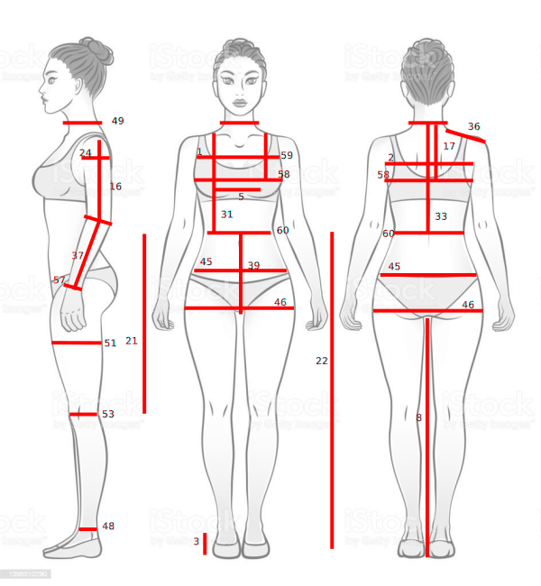
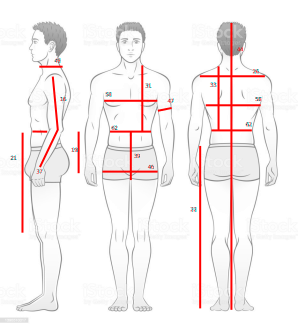
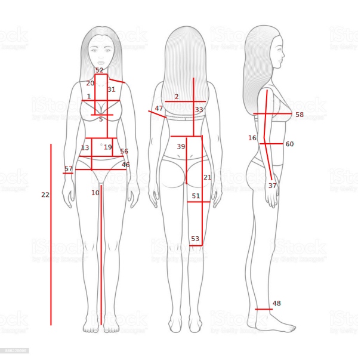
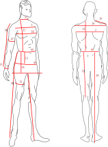
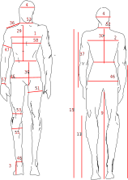

Sizes and Measurements
======================

Use existing measurements
-------------------------

OpenPattern comes with a set of standard sizes for women,  men and kids. For women and men the sizes
exist in french (Gilewska and Chiappetta) or Italian (Donnanno) sizes.
These measuremnts are stored in the ``measurement.db`` file which is an ``sqlite 3`` database.

The following table lists the status of the measures contained in the sql database
from OpenPattern.

========== ======= =========== =========== ======= ================
Source     Gender  Min Size    Max Size    N Meas. Meas Code sample
========== ======= =========== =========== ======= ================
Gilewska   Women   34          48          25      W34G
Gilewska   Men     36          54          24      M36G
Donnanno   Women   40          50          21      W40D
Donnanno   Men     44          54          19      M44D
Wargnier   Men     38          48          25      M38W
Chiappetta Girls   2 ans       16 ans      23      W3C
Chiappetta Boys    6 ans       16 ans      20      G6C
Chiappetta Men     36          50          22      M38mC
========== ======= =========== =========== ======= ================

*Sizes available in the measurements database. The example code
corresponds to the calling code of the minimum size.*

to look at measurement you can use the Pattern class of OpenPattern
Indeed when you load measurements in open Pattern they are stored in a dictionnary called ``m``.
Hence it is quite simple to see how they look like using the following code

.. code:: python

  # Check the content of Gilewska 38 for women
  p = OP.Pattern(pname="W38G", dbPATH="../measurements/")
  for key, val in p.m.items():
      print(key, val)

The result will print on the screen as follows::

    tour_poitrine 88.0
    tour_taille 66.0
    tour_petites_hanches 81.0
    tour_bassin 92.0
    longueur_dos 41.75
    longueur_devant 45.4
    hauteur_poitrine 26.5
    hauteur_petites_hanches 9.2
    hauteur_bassin 19.75
    ecart_poitrine 19.5
    carrure_dos 35.5
    carrure_devant 34.0
    tour_encolure 37.0
    longueur_epaule 13.8
    longueur_manche 59.0
    hauteur_coude 35.0
    tour_bras 28.0
    tour_poignet 16.0
    longueur_taille_terre 100.0
    hauteur_taille_genou 58.0
    montant 25.5
    tour_cuisse 56.0
    tour_genou 37.0
    tour_cheville 21.0
    fourche 61.0

.. note:: All measurements are given in centimeters !

By entering these measures and starting to use them I identified no
less than 52 different measurements from my sources. The distribution of these
different measures depending on the sources gives the measure :)) of
trouble ahead.  Everyone uses a common set of measurements but embroiders in
adding or not different measures and even changing the names!
This will pose a problem, for example, for the outline of the shoulders of the man who presents
inconsistencies depending on the authors.

.. warning::
  I'll try to make all these measurement fit together but it takes time so meanwhile
  I recommend you use the sizes that correspond to the stylist you wish to use knowing
  the differences between  your size and the one used by these stylist.

Bespoke Measurements
--------------------

Upload your own measurements in the database
~~~~~~~~~~~~~~~~~~~~~~~~~~~~~~~~~~~~~~~~~~~~

Now let's get bespoke. Due to what has been discussed before, the set of measurements you need
to make depends on the stylist and pattern. In the following paragraphs below are some figures of measurements
depending on the stylist.

Once done these measurement can be stored in a csv file an example of wich is given in the measurement directory.
The number in the figures refers to the M.N column in the example spreadsheet.

Once your done filling the spreadsheet export it to csv and use the ``load_sql()`` method of the Pattern class.
An exemple spreadsheet with Donnanno style measurements is given in the measurement section and the

.. code:: python

  p = OP.Pattern(dbPATH="../measurements/")
  p.load_measurements("../measurements/measurement_sheet_Esther.csv")

.. warning::
  Beware to do the upload only once as I have not yet included a test for doubles.

If you want to look at your measurements just use

.. code:: python

  p = OP.Pattern(pname="Esther", dbPATH="../measurements/")
  for key, val in p.m.items():
      print(key, val)

and the result looks like ::

  carrure_devant 34.0
  carrure_dos 35.0
  cheville_terre 8.0
  ecart_poitrine 16.0
  entrejambe 79.0
  hauteur_coude 34.0
  hauteur_cou_dessous_bras 17.0
  hauteur_taille_genou 60.0
  hauteur_taille_terre 102.0
  largeur_bras 9.0
  longueur_epaule 12.0
  longueur_devant 39.0
  longueur_dos 37.0
  longueur_manche 60.0
  ...

Donnanno measurements
~~~~~~~~~~~~~~~~~~~~~~
Numbers refer to the M.N. colum of the ``measurement_sheet_sample.ods``

Gilewska measurement
~~~~~~~~~~~~~~~~~~~~

Chiappetta measurement
~~~~~~~~~~~~~~~~~~~~~~

To go further (Discussion)
--------------------------

Kids, Men and women
~~~~~~~~~~~~~~~~~~~

The distinction between boy and man is not insignificant. Indeed if
the effects of puberty on girls are known and result
in particular the use of bust and waist darts, the patterns of
bases without clamps practically do not change. For men the
puberty produces an inversion of the shape of the bust. The chest circumference
of a boy is indeed smaller than his hip circumference like
a woman's. From this point of view, important for the design of a pattern,
the boy and the girl are of similar morphologies and closer to the
woman than to the man. Puberty reverses the situation in men whose
chest circumference  becomes larger than the hip circumference. This
change clearly influences the tracing of the male pattern  even if, surprisingly,
this is never discussed.

A consequence  is that it will probably be more in our interest to
use female models to draw the pattern of a man whose
hip is wider than his chest. The effect will be
probably better than with a classic male pattern.

Size Zoology
~~~~~~~~~~~~~~~~~

Generally men are less well  treated than women in the books of stylists (with the exception of
Chiappetta boys), probably because of the limited market they
represent, and of the least interest of their clothing (shirt, jacket,
pants to keep it simple). And in fact it goes in all directions
for men... The biggest gap separates designers who measure
the width of the shoulders and those who measure the length of the
shoulders. Some measure both but it is rarer. We
Note that typical measurements vary from book to book. There are not always
measurements of arm circumference, or thigh circumference for example.

Worse some like Chiappetta differentiates between shirt sizes and pants sizes. (the one I keep here). The associated drop (difference between
half chest circumference and half waist circumference) and stature (three
heights are given 170,175 and 180 cm).

Finally, the cherry on the cake, the correspondences of sizes vary from one
country to another so a 38 from Gilewska is not a 38 from Donnanno...
Officially it is necessary to add 4 to the Italian sizes to find,
approximately, the French size. A 36 from Gilewska matches
approximately a 40 from Donnanno. Except that in fact when we compare the
values ​​we are rather on a difference of 2 (a 38 Gilewska
would rather correspond from my point of view to a 40 Donnanno).

========================== == == == == == === === ==
Mesure                     WG MG WD MD MW GiC BoC MC
========================== == == == == == === === ==
carrure_devant             X  X  X     X  X       X
carrure_dos                X  X  X     X  X   X   X
cheville_terre                   X        X   X   X
crane                                     X   X   X
ecart_poitrine             X     X
encolure_dos                     X
enfourchure                            X
entrejambe                    X        X
entrejambe_terre                              X   X
fourche                    X
genou_sol                                         X
genou_terre                                   X
hauteur_bassin             X  X  X  X  X  X
hauteur_carrure            X
hauteur_corps                          X          X
hauteur_coude              X  X     X     X   X
hauteur_cou_dessous_bras         X
hauteur_emmanchure         X
hauteur_petites_hanches    X
hauteur_poitrine           X
hauteur_taille_genou       X     X  X  X  X
hauteur_taille_terre             X     X
hauteur_tete                           X
largeur_bras                     X
largeur_encolure           X
largeur_epaule                X     X
largeur_secteur                     X
longueur_7cerv_enc                                X
longueur_col_devant        X                      X
longueur_col_dos           X                      X
longueur_devant            X  X  X  X  X  X
longueur_devant_7c                     X
longueur_dos               X  X  X  X  X  X   X   X
longueur_emmanchure_devant X        X             X
longueur_emmanchure_dos    X        X             X
longueur_epaule            X  X  X  X  X  X   X   X
longueur_manche            X  X  X  X  X  X   X   X
longueur_taille_terre      X  X     X     X
montant                    X  X  X  X  X  X   X   X
profondeur_emmanchure      X        X
profondeur_encolure_devant X
profondeur_encolure_dos    X
profondeur_poitrine              X
stature                          X  X
tour_abdomen                     X
tour_bassin                X  X  X  X  X  X   X   X
tour_bras                  X  X  X        X   X   X
tour_cheville              X     X        X   X   X
tour_cou                         X
tour_coude                       X
tour_cuisse                X  X  X     X          X
tour_encolure              X  X     X  X  X   X   X
tour_genou                 X     X        X   X   X
tour_jarret                            X
tour_mollet                            X  X   X   X
tour_petites_hanches       X
tour_poignet               X  X  X     X  X   X   X
tour_poitrine              X  X  X  X  X  X   X   X
tour_poitrine_haute              X
tour_taille                X  X  X  X  X  X   X   X
tour_tete                              X
========================== == == == == == === === ==

*Measures and sources*

W: Women, M: men, Gi: Girl; Bo: Boy, G: Gilewska, D: Donnanno, C: Chiappetta, W: Wargnier
