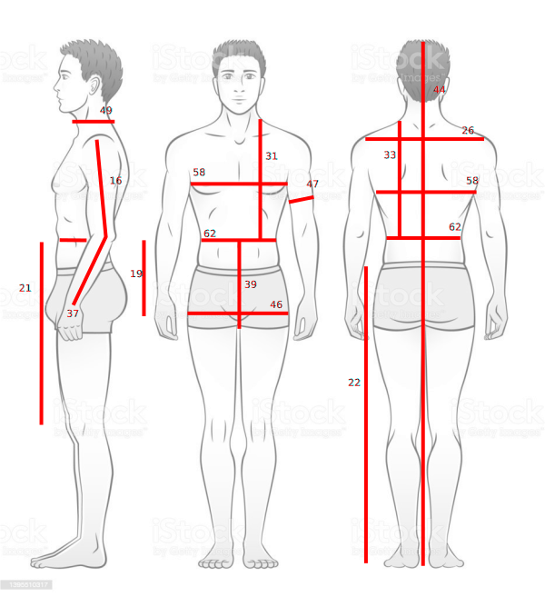

Sizes and Measurements
======================

Use existing measurements
-------------------------

OpenPattern comes with a set of standard sizes for women,  men and kids. For women and men the sizes
exist in french (Gilewska and Chiappetta) or Italian (Donnanno) sizes.
These measuremnts are stored in the ``measurement.db`` file which is an ``sqlite 3`` database.

The following table lists the status of the measures contained in the sql database
from OpenPattern.

========== ======= =========== =========== ======= ================
Source     Gender  Min Size    Max Size    N Meas. Meas Code sample
========== ======= =========== =========== ======= ================
Gilewska   Women   34          48          25      W34G
Gilewska   Men     36          54          24      M36G
Donnanno   Women   40          50          21      W40D
Donnanno   Men     44          54          19      M44D
Wargnier   Men     38          48          25      M38W
Chiappetta Girls   2 ans       16 ans      23      W3C
Chiappetta Boys    6 ans       16 ans      20      G6C
Chiappetta Men     36          50          22      M38mC
========== ======= =========== =========== ======= ================

*Sizes available in the measurements database. The example code
corresponds to the calling code of the minimum size.*

By entering these measures and starting to use them I identified no
less than 52 different measurements from my sources. The distribution of these
different measures depending on the sources gives the measure :)) of
trouble ahead.  Everyone uses a common set of measurements but embroiders in
adding or not different measures and even changing the names!
This will pose a problem, for example, for the outline of the shoulders of the man who presents
inconsistencies depending on the authors.

Generally men are less well  treated than women in these works (with the exception of
Chiappetta boys), probably because of the limited market they
represent, and of the least interest of their clothing (shirt, jacket,
pants to keep it simple). And in fact it goes in all directions
for men... The biggest gap separates designers who measure
the width of the shoulders and those who measure the length of the
shoulders. Some measure both but it is rarer. We
Note that typical measurements vary from book to book. There are not always
measurements of arm circumference, or thigh circumference for example.

Worse some like Chiappetta differentiates between shirt sizes and pants sizes. (the one I keep here). The associated drop (difference between
half chest circumference and half waist circumference) and stature (three
heights are given 170,175 and 180 cm).

Finally, the cherry on the cake, the correspondences of sizes vary from one
country to another so a 38 from Gilewska is not a 38 from Donnanno...
Officially it is necessary to add 4 to the Italian sizes to find,
approximately, the French size. A 36 from Gilewska matches
approximately a 40 from Donnanno. Except that in fact when we compare the
values ​​we are rather on a difference of 2 (a 38 Gilewska
would rather correspond from my point of view to a 40 Donnanno).

.. warning::
  I'll try to make all these measurement fit together but it takes time so meanwhile
  I recommend you use the sizes that correspond to the stylist you wish to use knowing
  the differences between  your size and the one used by these stylist.

Bespoke Measurements
--------------------

Upload your own measurements in the database
~~~~~~~~~~~~~~~~~~~~~~~~~~~~~~~~~~~~~~~~~~~~

Now let's get bespoke. Due to what has been discussed before, the set of measurements you need
to make depends on the stylist and pattern. Below are some figures of measurements
depending on the stylist.

Once done these measurement can be stored in a csv file an example of wich is given in the measurement directory.
The number in the figures refers to the M.N column in the example spreadsheet.

Once your done filling the spreadsheet export it to csv and use the ``load_sql()`` method of the Pattern class.
An exemple spreadsheet with Donnanno style measurements is given in the measurement section and the

.. code:: python

  p = OP.Pattern(dbPATH="../measurements/")
  p.load_measurements("../measurements/measurement_sheet_Esther.csv")

.. warning::
  Beware to do the upload only once as I have not yet included a test for doubles.

Look at the measurements
~~~~~~~~~~~~~~~~~~~~~~~~
You can look at your measurements of even upload ones directly by using ``SQL`` to do this
you can do it from the command line but you then need to have sqlite3 installed  or you can
write some simple python function that will do the job.

Donnanno measurements:
~~~~~~~~~~~~~~~~~~~~~~

.. figure:: ../../measurements/Donnanno.svg
  :alt: Size measurements for women proposed by Donnanno

Pour aller plus loin
--------------------

Les tailles
~~~~~~~~~~~

Le tableau suivant recense l’état des mesures que contient la base sql
d’OpenPattern.

========== ======= =========== =========== ======= ===============
Source     Genre   Taille min. Taille max. Mesures example de Code
========== ======= =========== =========== ======= ===============
Gilewska   Femmes  34          48          25      W34G
Gilewska   Hommes  36          54          24      M36G
Donnanno   Femmes  40          50          21      W40D
Donnanno   Hommes  44          54          19      M44D
Wargnier   Hommes  38          48          25      M38W
Chiappetta Filles  2 ans       16 ans      23      W3C
Chiappetta Garçons 6 ans       16 ans      20      G6C
Chiappetta Homme   36          50          22      M38mC
========== ======= =========== =========== ======= ===============

*Tailles disponibles dans la base measurements. Le code donné en exemple
correspond au code d’appel de la taille minimum.*

Notons que la distinction garçon, homme n’est pas anodine. En effet si
les effets de la puberté sur les filles sont connus et aboutissent
notamment à l’usage des pinces de buste et de taille, les patrons de
bases sans pinces ne changent pratiquement pas. Chez les hommes la
puberté produit une inversion de la forme du buste. Le tour de poitrine
d’un garçon est en effet plus petit que son tour de bassin à l’instar
d’une femme. De ce point de vue, important pour le dessin d’un patron,
le garçon et la fille sont de morphologies proches et plus proche de la
femme que de l’homme. La puberté inverse la situation chez l’homme dont
le tour de poitrine devient plus grand que son tour de bassin. Ce
changement influence de façon nette le traçage du patron masculin et ce
qu’on y projette dans tous les sens du terme même si de façon étonnante
ceci n’est jamais discuté.

Un conséquence de cela est qu’on aura probablement plutôt intérêt à
utiliser des modèles féminins pour dessiner le patron d’un homme dont le
bassin est plus large que sont tour de poitrine. L’effet sera
probablement meilleur qu’avec un patron masculin classique.

========================== == == == == == === === ==
Mesure                     FG HG FD HD HW FiC GaC HC
========================== == == == == == === === ==
carrure_devant             X  X  X     X  X       X
carrure_dos                X  X  X     X  X   X   X
cheville_terre                   X        X   X   X
crane                                     X   X   X
ecart_poitrine             X     X
encolure_dos                     X
enfourchure                            X
entrejambe                    X        X
entrejambe_terre                              X   X
fourche                    X
genou_sol                                         X
genou_terre                                   X
hauteur_bassin             X  X  X  X  X  X
hauteur_carrure            X
hauteur_corps                          X          X
hauteur_coude              X  X     X     X   X
hauteur_cou_dessous_bras         X
hauteur_emmanchure         X
hauteur_petites_hanches    X
hauteur_poitrine           X
hauteur_taille_genou       X     X  X  X  X
hauteur_taille_terre             X     X
hauteur_tete                           X
largeur_bras                     X
largeur_encolure           X
largeur_epaule                X     X
largeur_secteur                     X
longueur_7cerv_enc                                X
longueur_col_devant        X                      X
longueur_col_dos           X                      X
longueur_devant            X  X  X  X  X  X
longueur_devant_7c                     X
longueur_dos               X  X  X  X  X  X   X   X
longueur_emmanchure_devant X        X             X
longueur_emmanchure_dos    X        X             X
longueur_epaule            X  X  X  X  X  X   X   X
longueur_manche            X  X  X  X  X  X   X   X
longueur_taille_terre      X  X     X     X
montant                    X  X  X  X  X  X   X   X
profondeur_emmanchure      X        X
profondeur_encolure_devant X
profondeur_encolure_dos    X
profondeur_poitrine              X
stature                          X  X
tour_abdomen                     X
tour_bassin                X  X  X  X  X  X   X   X
tour_bras                  X  X  X        X   X   X
tour_cheville              X     X        X   X   X
tour_cou                         X
tour_coude                       X
tour_cuisse                X  X  X     X          X
tour_encolure              X  X     X  X  X   X   X
tour_genou                 X     X        X   X   X
tour_jarret                            X
tour_mollet                            X  X   X   X
tour_petites_hanches       X
tour_poignet               X  X  X     X  X   X   X
tour_poitrine              X  X  X  X  X  X   X   X
tour_poitrine_haute              X
tour_taille                X  X  X  X  X  X   X   X
tour_tete                              X
========================== == == == == == === === ==

*Répartition des mesures par source*
