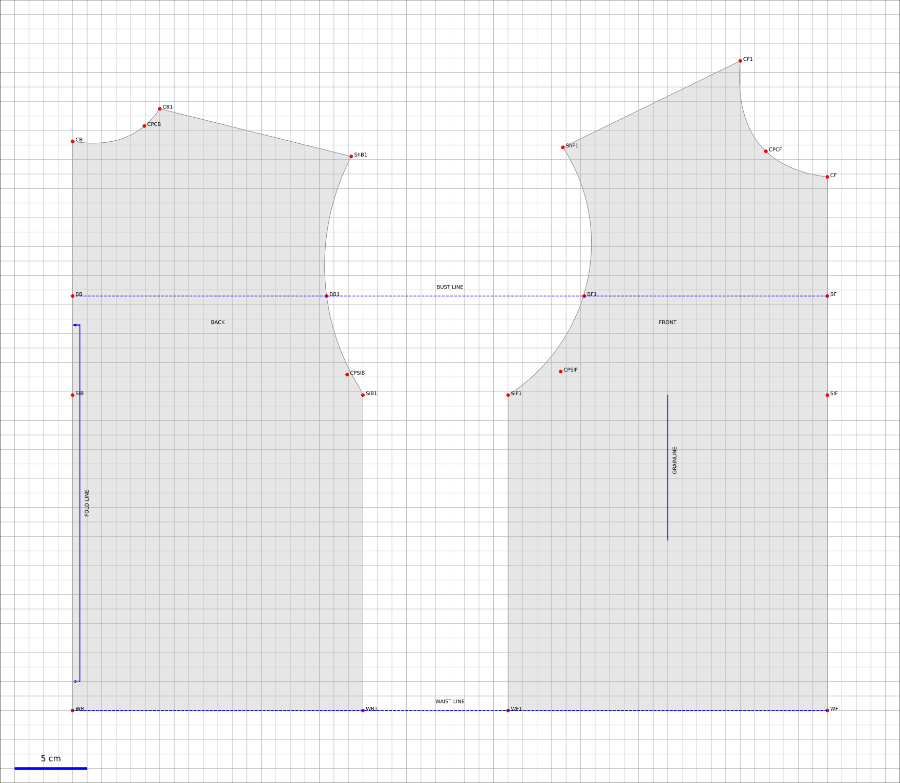
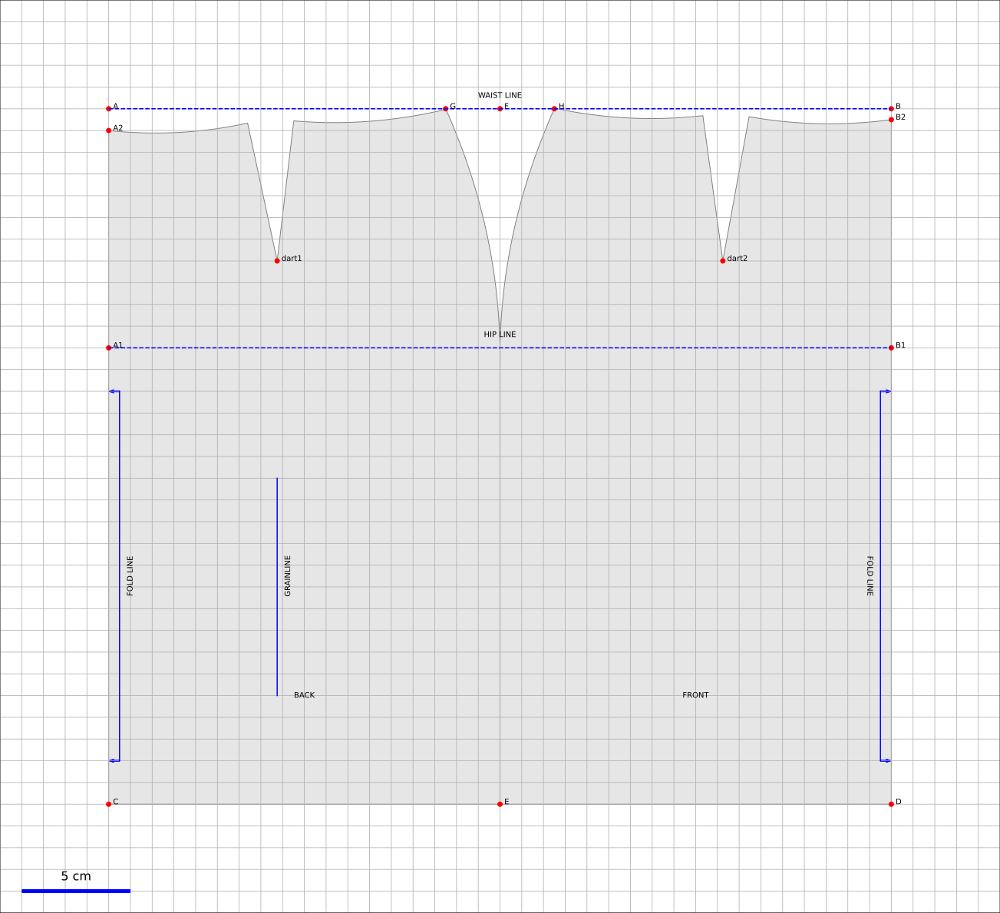
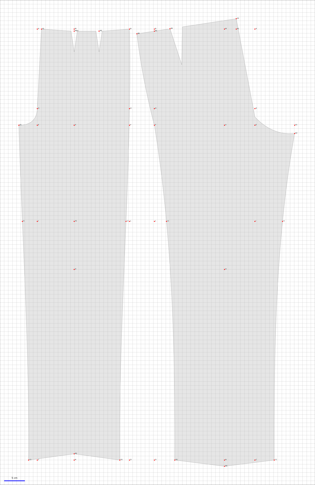

Tutorial
========

Operation principle
-------------------

To draw a pattern you need to

1. create an instance of the corresponding class,

2. call different methods of altering or modifying,

3. draw and, if necessary, save the pattern.

The drawing of the pattern can also be done directly from the classes
``Pattern`` and ``Point`` as we will see later. To start, however, I recommend that you use the
existing library patterns. I will add patterns as I go.
extent of my free time.

The Basic Pattern
-----------------

This tutorial shows how to use the available classes to draw
complete patterns from standard measurements (a French 38 by
example) or from bespoke measurements taken on the person of your choice.
Different classes allow you to do this first job, often the most difficult,
which consists of drawing a pattern base: base of
pants, skirts base, bust and sleeve base. From these
patterns it is then possible either to use the database directly (for
a straight skirt or basic trousers for example) or
"alter" or "transform" this base according to your imagination.

:warning: In all the scripts of the tutorial I consider that the base of data ``measurements.db`` is in the same directory as the script major.

.. note:: The measurements are registered in *French* (sorry for this). A lengthy discussion on measurements issues can be found in this doc

Bodice
~~~~~~

The following script shows the principle of using the library
OpenPattern taking the example of a Body. We will draw and
save a pattern for a woman's bodysuit without darts in 36 (size
French) according to Gilewska's method.

.. code:: python

   import matplotlib.pyplot as plt
   import OpenPattern as OP

   # Creation de l'instance
   p = OP.Basic_Bodice(
     pname = "W36G",
     gender = 'w',
     style = 'Gilewska'
     )

   # appel de la fonction de dessin
   p.draw()

   plt.show()

It's easy isn't it? We then obtain the following figure saved by default at 1:1 scale in a pdf file.

The different options are passed in the arguments of the different
class methods (``draw_bodice``) or when instantiating
class (``Basic_Bodice`` in this example).

The list of body bases currently available is given
below We are going to see in detail each of the bases and
their options.

========== ====== ====== =======
Style      Women  Men    Kids
========== ====== ====== =======
Chiappetta        x      2-16
Donnanno   x      x
Gilewska   x      x
========== ====== ====== =======

Note that as far as the men are concerned, the bodysuits by Gilewska and
Donnanno are actually simple shirts without the sleeves. Sleeves
precisely are part of the body class because they are calculated at
from the armhole depths measured on the bodysuits.

.. warning::

  Note the 1cm squares on the figure. You should always check on a print
  that the scale is ok because more often then not printers automatically adjust the size of print (you do not want your nice 40 to become a small 36 do you ?).
  Furthermore, at the request from a friend, I added the scale bar
  (to be sure that everything is fine !).

Skirt
~~~~~

The following script shows how to create a basic skirt (or pencil skirt
or spindle or pencil in English)

.. code:: python

   import OpenPattern as OP
   p = OP.Basic_Skirt(
     pname="W6C",
     style='Chiappetta',
     gender = 'G',
     ease=8,
     curves=False
     )

   p.draw()

The arguments upon instantiation of the class are as follows

+----------+--------------+--------------------+-------------------+
| Argument | type         | Definition         | default value     |
+==========+==============+====================+===================+
| pname    | str          | size code          | W6C               |
+----------+--------------+--------------------+-------------------+
| style    | str          | Style used         | Chiappetta        |
+----------+--------------+--------------------+-------------------+
| gender   | str          | gender             | G                 |
+----------+--------------+--------------------+-------------------+
| ease     | int ou float | ease to be         | 8                 |
|          |              | applied to the     |                   |
|          |              | pattern            |                   |
+----------+--------------+--------------------+-------------------+
| curves   | boolean      | Should the waits   | False             |
|          |              | be drawn as        |                   |
|          |              | a curve            |                   |
+----------+--------------+--------------------+-------------------+
| kwargs   | dic          | supplementary      | vide              |
|          |              | arguments          |                   |
|          |              | as dbPATH          |                   |
+----------+--------------+--------------------+-------------------+

Note that for Donnanno style the pencil skirt is symmetrical whereas for
Gilewska it is slightly asymmetrical with a wider half front
(1cm) than the half back. Donnanno Treats this asymmetry as a
transformation and we will find it in the “shifted-side-seams” skirt by
example. For Chiappetta, the girl's pencil skirt is symmetrical whatever
the age.

Trousers
~~~~~~~~

To create trousers with darts we use the class
``Basic_Trousers``

.. code:: python

   import OpenPattern as OP
   pans = OP.Basic_Trousers(
       pname="M44D",
       gender="m",
       style="Donnanno",
       darts=True,
       dbPATH="../measurements/",
       figPATH="../docs/samplePatterns/",
       frmt="svg",
   )
   # pans.Donnanno_add_darts()

   pans.draw_basic_trousers(dic={"Pattern": "Basic trousers with dart"}, save=True)

Currently only the Donnanno style is implemented for
pants. If you choose another style a message will be displayed
indicating the unavailability of the requested style and OpenPattern will attempt to
draw pants according to the Donnano style.

Alterations (Transformations)
-----------------------------

Children classes have been added to the three basic classes for skirts, cullotes and Bermudas, Trousers, shirts,  dresses and waistcoats.
These classes are under construction and I complete them when I have time!
Ancillary classes are also added  for cuffs, plackets, and collars

-  Waistband

-  Cuffs

-  Placket

-  Collars

- Gowns

  - Hospital_Gown (done during the first COVID confinement)

- Shirts

  - Basic shirt

  - Yoked shirt

-  Skirts

   -  Culotte

   -  Skirt transform (Shifted side seam, A line, Flared A Line)

-  Trousers

   -  Bermudas

   -  Flared pants

   -  Pants block

- Waistcoats

.. code:: python

   Cuffs(pname = "sophie", gender = 'w', style = 'Donnanno', age = 12, cuff_style = 'Simple',\
     overlap = 2, width = 5, ease = 3 )
   Placket(pname = "sophie", gender = 'w', placket_style = 'Simple', slit_length = 10)
   Collars(pname="sophie", gender='w', style='Gilewska', collar_style = 'Officer',\
     overlap=0, collar_height=3)
