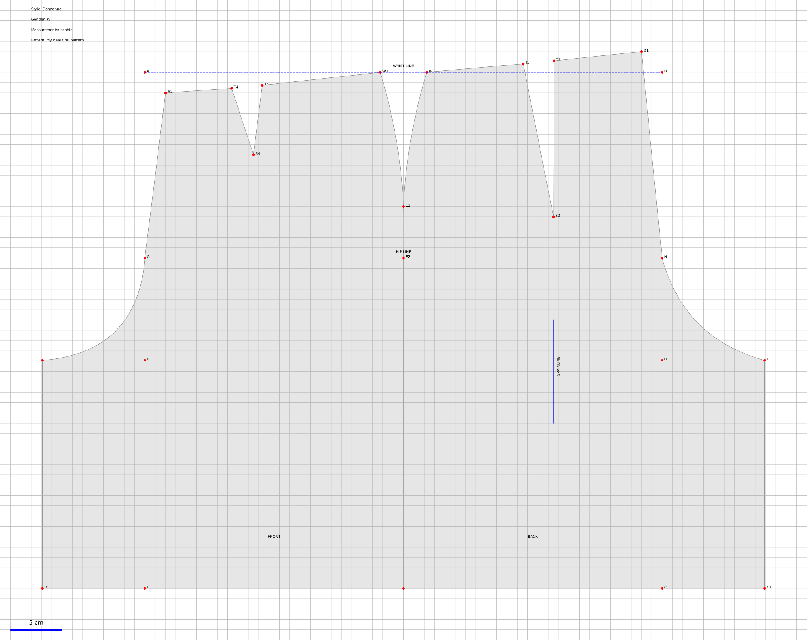

.. OpenPattern documentation master file, created by
   sphinx-quickstart on Sun Jul 24 21:07:51 2022.
   You can adapt this file completely to your liking, but it should at least
   contain the root `toctree` directive.

Welcome to OpenPattern's documentation!
=======================================

.. note::

   This project is under active development. For an introduction in French
   introduction see the doc on Github in the fdoc folder.

.. toctree::
   :maxdepth: 2
   :caption: Contents:

What is it ?
------------

OpenPattern is a python library consisting of a set of classes
designed to draft 1:1 scale bespoke sewing patterns and save them as pdf (or matplotlib compatible)
files for printing of further processing.

Printing can be performed at fullscale on a tracer but OpenPattern can also cut the pattern in as many pieces as needed in order to print them on an A4 printer at home.

OpenPattern can be used to draft patterns from scratch but also
includes a set of predefined patterns from basics (or bases in French)
such as bodices  to more elaborate patterns such as shirts.
The patterns are drafted following instructions from three
main stylists: <a href="https://lespressesdumidi.com/content/18-jacqueline-chiappetta">Jacqueline Chiappetta</a>,
<a href="https://www.editions-eyrolles.com/Auteur/86662/teresa-gilewska">Theresa Gilewska</a>
and <a href="https://www.euromodeschool.it/index.html">Antonnio Donnano </a>.
Sizes are stored in a ``sqlite3`` database. By default they
include a series of standard (French and Italian) sizes for Women,
Men, Girls and Boys given by these authors.

Why ?
-----

I developped OpenPattern to draft bespoke patterns for my family.
In the end the results look like This

.. code-block:: python

  #############################
  # Draw a Bespoke Culotte
  # (Jupe culotte in French)
  # for Sophie
  # style from Donnano
  #############################
  import OpenPattern as OP
  import matplotlib.pyplot as plt

  p = OP.Culotte(
      pname="sophie",
      style="Donnanno",
      ease=1,
      dbPATH="../measurements/",
      figPATH="../samplePatterns/",
      frmt="svg",
  )
  p.draw(save=True, fname="culotte")
  plt.show()

Content
=======

.. toctree::
  Introduction

.. toctree::
  Installation

.. toctree::
  Tutorial

.. toctree::
  FromScratch

.. toctree::
  Sizes

.. toctree::
  Classes

.. toctree::
  Participate

.. toctree::
  Comments

.. toctree::
  References

Indices and tables
==================

* :ref:`genindex`
* :ref:`modindex`
* :ref:`search`
